neural-rs
===

neural-rs is a spiking neural network library for Rust (similar to [Brian2](https://github.com/brian-team/brian2) or [Nest](http://www.nest-initiative.org/Software:About_NEST)).

Izhikevich neuron model
---

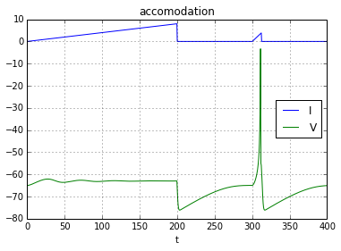

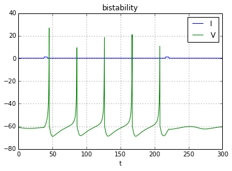

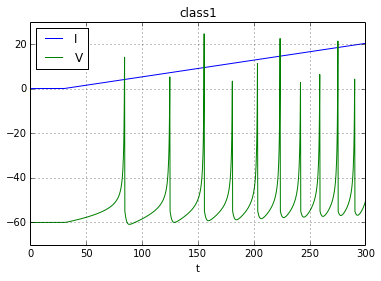

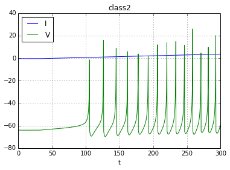

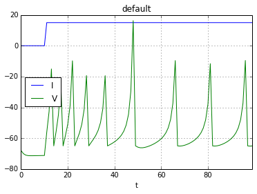

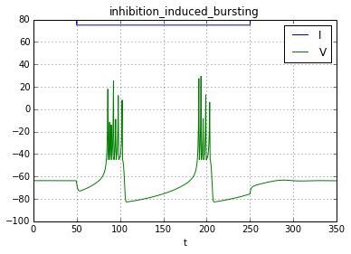

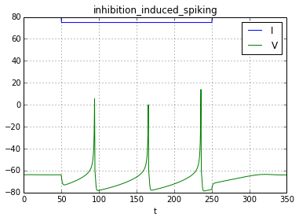

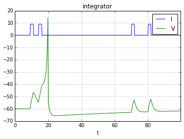

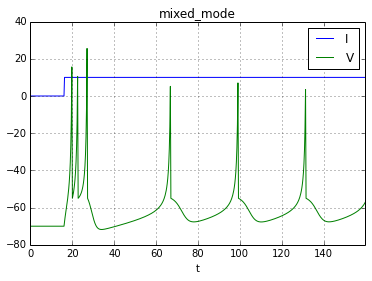

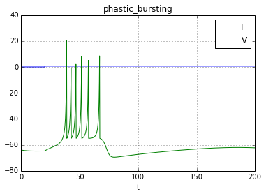

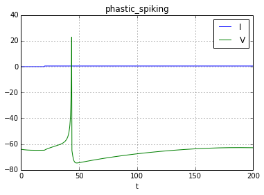

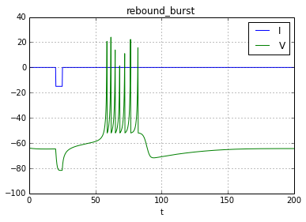

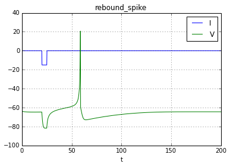

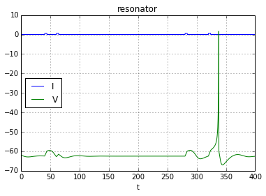

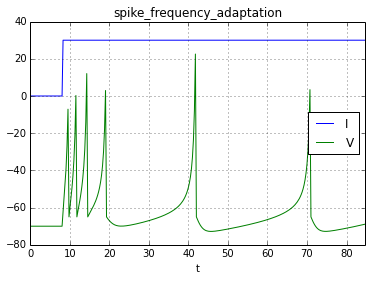

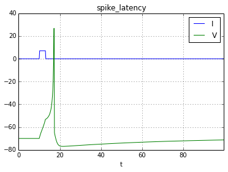

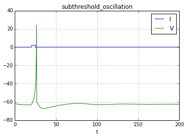

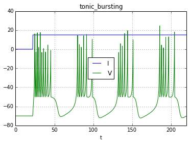

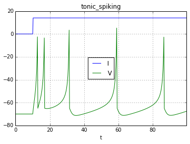
