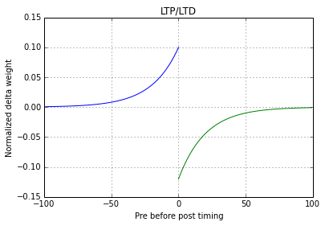

neural-rs
===

neural-rs is a spiking neural network library for Rust (similar to [Brian2](https://github.com/brian-team/brian2) or [Nest](http://www.nest-initiative.org/Software:About_NEST)).

TODO
---

#### Implement AdEx model

I haven't used it but its supposed to be better for a number of reasons: http://www.scholarpedia.org/article/Adaptive_exponential_integrate-and-fire_model

If nothing else I'm hoping the model won't require any special casing for various firing patterns (see: src/izhikevich/neuron.rs#L86).

#### Better benchmarks and performance

Its much faster than my Go implementation by about an order of magnitude but that doesn't mean much.

The slowest part is the synapse update phase because, well, there are usually many more synapses... Maybe time to look at parallelizing on the GPU: https://github.com/luqmana/rust-opencl.

Izhikevich neuron model
---

STDP synapse model
---

